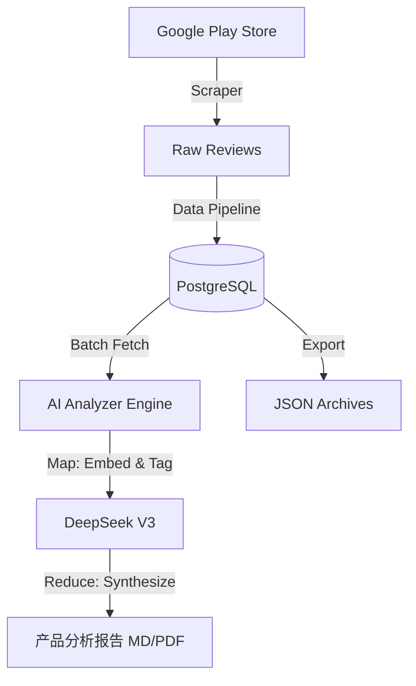

# AutoGooglePlayAnalyzer 🚀

> 专业的 Google Play 评论自动化采集与智能审计系统

<div align="center">
  <h3>您的 APP 舆情分析智能中台</h3>
  <p>不仅仅是数据采集，更是将海量用户反馈转化为商业洞察的终极解决方案。</p>
  
  <p>
    
    
    
    
    
  </p>

  <p>
    <a href="#-核心功能">核心功能</a> • 
    <a href="#-系统架构">系统架构</a> • 
    <a href="#-安装指南">安装指南</a> • 
    <a href="#-快速接入">快速接入</a>
  </p>
</div>

---

**AutoGooglePlayAnalyzer** 是一个为数据分析师和产品经理设计的全流程自动化工具。它将高并发爬虫、数据库持久化存储与大模型深度分析完美结合，为您提供一个稳定、极速且洞察深刻的 **本地舆情分析引擎**。

通过本应用，您可以将数万条非结构化的用户评论转化为结构化的商业审计报告，消除数据噪音，直击用户痛点。

## ✨ 新功能：Web Dashboard

**v1.1.0** 新增可视化 Web 控制台，无需命令行即可完成全部操作！

```bash
python app.py
```

启动后浏览器自动打开，支持：
- 🎛️ **可视化配置** - App ID、国家、语言一键设置
- 📊 **实时进度** - 抓取和分析过程实时显示
- 📝 **报告预览** - 支持 Markdown 和 PDF 双格式查看
- 💾 **数据导出** - 一键导出 JSON 数据

## 🌟 深度功能解析

### 1. 🕷️ 高性能数据采集
*   **全量抓取**: 支持递归分页抓取，轻松处理 10,000+ 级别的评论数据量
*   **智能去重**: 基于数据库唯一约束的增量更新机制，确保数据永不重复
*   **多维度元数据**: 采集内容涵盖评论正文、评分、时间、用户名称、点赞数等关键指标

### 2. 💾 企业级数据持久化
*   **PostgreSQL 驱动**: 采用工业级关系型数据库，通过连接池技术保障高并发写入稳定性
*   **增量更新**: 自动识别新评论，仅对增量数据进行入库

### 3. 🧠 AI 驱动的 Map-Reduce 分析引擎
*   **原子化标注 (Map)**: 并发调用 LLM 对每条评论进行多维度打标（用户画像、使用场景、核心痛点）
*   **全局洞察归纳 (Reduce)**: 自动汇总成千上万条标注数据，生成麦肯锡风格的深度商业审计报告
*   **多模态输出**: 支持 Markdown 报告及 PDF 自动转换

## 🏗️ 系统架构



## 📁 项目结构

```text
/
├── app.py              <-- [Entry] Web Dashboard 入口
├── web/                <-- [Web] Flask 应用模块
│   ├── routes.py       # API 路由
│   ├── config.py       # Web配置
│   ├── templates/      # HTML 模板
│   └── static/         # CSS/JS 资源
├── src/                <-- [Core] 核心代码包
│   ├── config.py       # 核心配置
│   ├── database.py     # 数据库连接池
│   ├── scraper.py      # 爬虫逻辑
│   └── analyzer.py     # 分析逻辑
├── main.py             <-- [CLI] 抓取入口
├── analyzer.py         <-- [CLI] 分析入口
├── export_reviews.py   <-- [CLI] 导出入口
├── convert_report.py   <-- [Tool] PDF 转换工具
├── requirements.txt    <-- 依赖列表
├── reports/            <-- 产出报告
└── exports/            <-- 产出数据
```

## ⚙️ 环境配置

### 1. 基础环境
确保您已安装 Python 3.9+ 和 PostgreSQL。

### 2. 依赖安装
```bash
pip install -r requirements.txt
```

### 3. 环境变量 (.env)
在项目根目录创建 `.env` 文件：

```env
# 数据库配置
DB_NAME=google_play_analysis
DB_USER=postgres
DB_PASSWORD=your_password
DB_HOST=localhost
DB_PORT=5432

# 目标应用配置
APP_ID=com.example.app  # 目标 App 包名
COUNTRY=us              # 商店区域
LANGUAGE=en             # 评论语言

# AI 分析配置 (推荐 DeepSeek，性价比高)
OPENAI_API_KEY=sk-...          # DeepSeek API Key
OPENAI_MODEL=deepseek-chat     # 模型名称
OPENAI_API_BASE=https://api.deepseek.com  # API 地址

# 采集分析配置
SCRAPE_COUNT=1000       # 单次抓取数量
TOTAL_TO_ANALYZE=500    # 分析样本数量
```

## 🚀 快速接入

### 方式一：Web Dashboard（推荐）

```bash
python app.py
```

浏览器自动打开控制台，可视化完成所有操作。

### 方式二：命令行

**第一步：全量抓取**
```bash
python main.py
```

**第二步：深度审计**
```bash
python analyzer.py
```
产出：`reports/产品分析报告_xxx.md`

**第三步：结果交付**
```bash
python convert_report.py  # 生成 PDF
python export_reviews.py  # 导出 JSON
```

## 💡 批次配置建议

基于 DeepSeek-V3 的 128K 上下文和 4K 输出限制：

| 分析条数 | 推荐批次数 | 每批条数 |
|---------|-----------|---------|
| 200     | 5-10      | 20-40   |
| 500     | 15-20     | 25-35   |
| 1000    | 25-40     | 25-40   |

> ⚠️ 每批超过 50 条可能导致输出截断，建议每批 ≤40 条

## 📝 版本演进

- **v1.1.0 (2026-01-28)**:
  - **[新增]** Web Dashboard 可视化控制台
  - **[新增]** 实时抓取/分析进度显示
  - **[新增]** PDF 在线预览功能
  - **[优化]** 默认 AI 改为 DeepSeek (性价比更高)
  - **[优化]** 报告增加元信息头部 (日期、样本数等)
  - **[修复]** 端口占用自动处理

- **v1.0.0 (2026-01-28)**:
  - 完成项目模块化重构
  - 增加 PDF 报告自动生成工具

---

Copyright © 2026 AutoGooglePlayAnalyzer Team