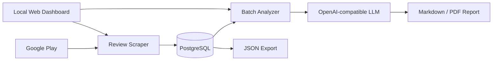

<div align="center">

# AutoGooglePlayAnalyzer

**Collect Google Play reviews, store them in PostgreSQL, and turn them into structured AI-assisted product research.**

面向产品经理和数据分析场景的本地评论采集与分析原型，提供 Web Dashboard 和 CLI 两种入口。


</div>

<p align="center">
  
</p>

> [!IMPORTANT]
> 这是可运行的本地原型，不是生产服务。仓库目前没有自动化测试和 CI；规模、速度和报告质量应以你自己的目标 App、地区、评论数量与模型配置实测为准。

## What It Does

AutoGooglePlayAnalyzer 把评论研究拆成一条可重复的本地流水线：

1. 按 App ID、国家或地区和语言采集 Google Play 评论；
2. 将评论与评分、时间、用户名和点赞数写入 PostgreSQL；
3. 使用 OpenAI-compatible API 对评论进行分批标注与汇总；
4. 生成 Markdown / PDF 报告，并可导出原始 JSON。

当前 Dashboard 支持配置采集参数、查看实时进度、预览报告和导出数据。CLI 入口适合脚本化运行。

## Architecture



| 入口 | 文件 | 用途 |
|---|---|---|
| Web | `app.py` | 启动本地 Dashboard |
| CLI | `main.py` | 采集评论 |
| CLI | `analyzer.py` | 运行 AI 分析 |
| CLI | `convert_report.py` | 将 Markdown 报告转换为 PDF |
| CLI | `export_reviews.py` | 导出数据库评论 |

## Prerequisites

- Python 3.9 或更高版本；
- 可访问的 PostgreSQL 实例和已创建的目标数据库；
- 运行 AI 分析时需要兼容 OpenAI API 的服务与密钥；
- 目标 App 必须能从所选 Google Play 区域访问。

## Quick Start

### 1. 创建 Python 环境

```bash
python3 -m venv .venv
source .venv/bin/activate
python -m pip install --upgrade pip
pip install -r requirements.txt
```

当前 `requirements.txt` 尚未声明 Web Dashboard 使用的 Flask。运行 Dashboard 前还需要：

```bash
python -m pip install Flask
```

这是一项已知依赖缺口；后续应在依赖清单中固定后再视为完全可复现安装。

### 2. 配置环境

在仓库根目录创建 `.env`：

```dotenv
DB_NAME=google_play_analysis
DB_USER=postgres
DB_PASSWORD=your_password
DB_HOST=localhost
DB_PORT=5432

APP_ID=com.example.app
COUNTRY=us
LANGUAGE=en

OPENAI_API_KEY=your_api_key
OPENAI_MODEL=deepseek-chat
OPENAI_API_BASE=https://api.deepseek.com

SCRAPE_COUNT=1000
TOTAL_TO_ANALYZE=500
```

不要提交真实数据库密码或 API Key。

### 3. 启动 Dashboard

> [!WARNING]
> `app.py` 当前会在启动前查找并强制终止占用 `5001` 端口的本机进程。运行前请确认该端口没有承载其他重要服务；这是现有实现行为，不应作为生产级端口管理方案。

```bash
python app.py
```

浏览器会打开 <http://127.0.0.1:5001>。

### 4. 使用 CLI

```bash
python main.py
python analyzer.py
python convert_report.py
python export_reviews.py
```

默认输出目录：

- `reports/`：Markdown 与 PDF 报告；
- `exports/`：JSON 数据。

## Configuration Notes

- `SCRAPE_COUNT` 控制单次目标采集量，实际返回数量取决于 Google Play；
- `TOTAL_TO_ANALYZE` 控制进入 AI 分析的样本量；
- 分批大小和模型上下文限制会影响成本、耗时与报告完整度；
- 不同语言和国家或地区的数据不应在缺少说明时直接混合比较。

## Data and Safety

- 评论正文和公开用户名会写入本地 PostgreSQL，请根据用途设置保存期限和访问权限；
- AI 分析会把选中的评论内容发送给配置的第三方模型服务；
- `.env`、报告和导出结果可能包含敏感业务信息，不应公开提交；
- Google Play 页面和非官方抓取依赖可能发生变化，采集结果需要抽样核验。

## Project Structure

```text
app.py                  Web Dashboard 入口
web/                    Flask 路由、模板与前端资源
src/scraper.py          评论采集
src/database.py         PostgreSQL 访问
src/analyzer.py         批处理与 AI 分析
main.py                 CLI 采集入口
analyzer.py             CLI 分析入口
convert_report.py       PDF 转换
export_reviews.py       JSON 导出
```

## Known Limitations

- Flask 尚未写入 `requirements.txt`；
- 当前没有自动化测试或 GitHub Actions；
- Dashboard 固定使用 `5001` 端口并带有强制清理行为；
- README 不提供未经基准测试支持的性能或分析质量承诺。

## License

代码采用 [MIT License](LICENSE)。
